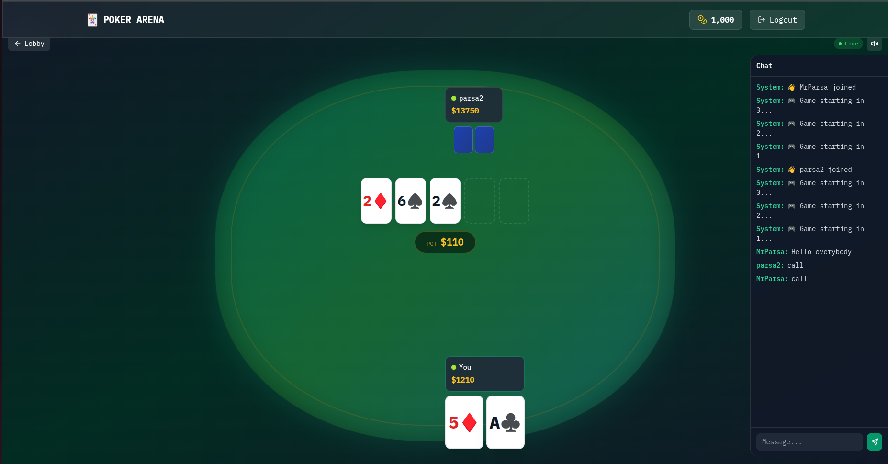
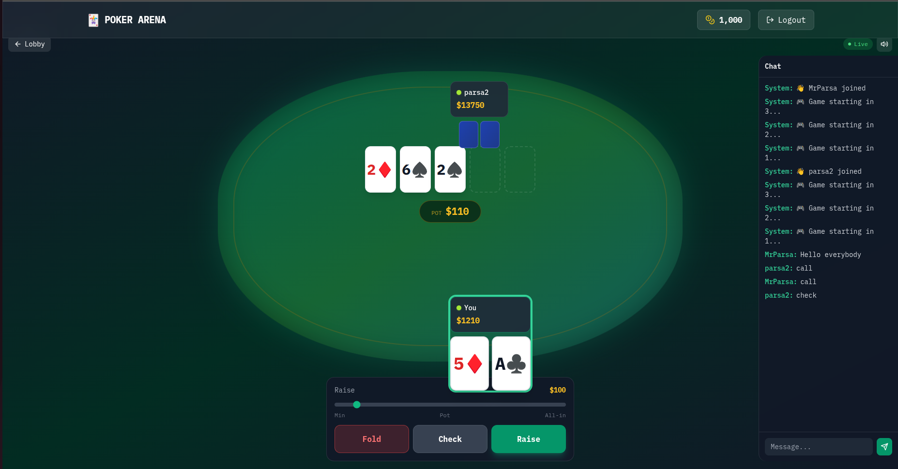
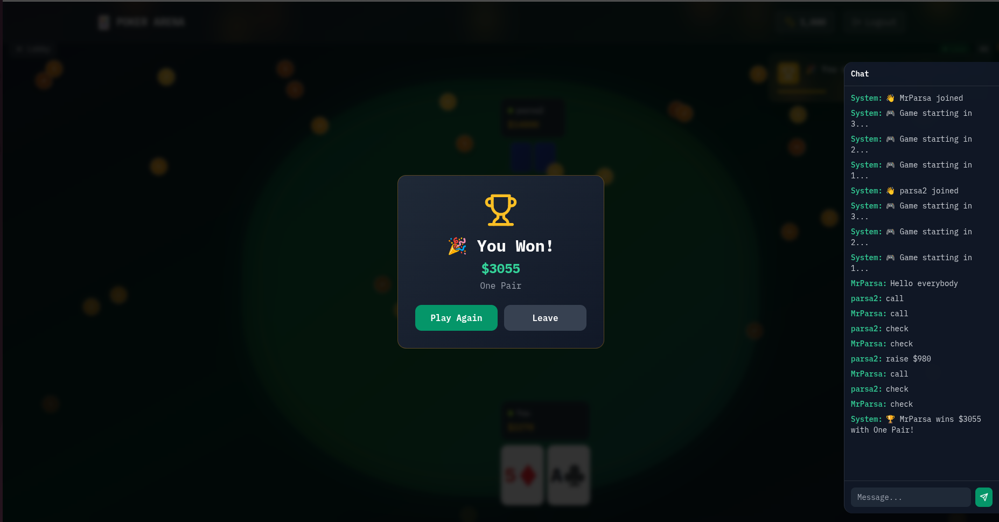
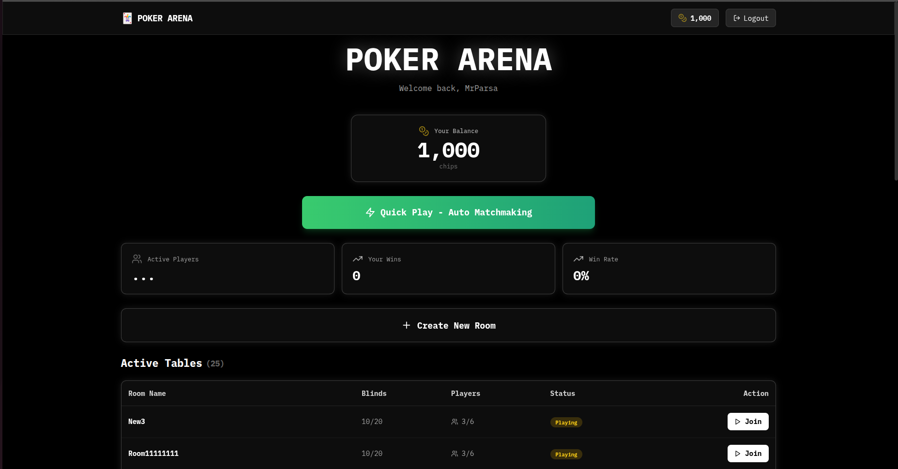
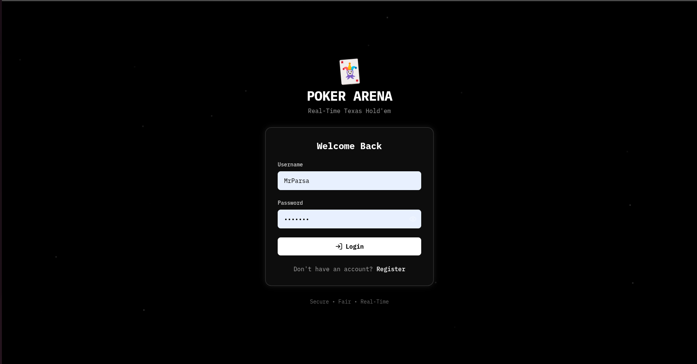
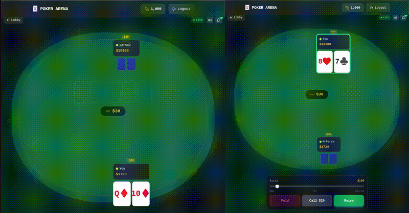

# 🃏 Go Poker Arena

<div align="center">

[](https://golang.org)
[](https://nextjs.org)
[](https://typescriptlang.org)
[](https://redis.io)
[](https://postgresql.org)
[](LICENSE)

**Real-time multiplayer Texas Hold'em Poker**

</div>

---

## 📸 Screenshots

<div align="center">

| Login | Sign Up |
|:---:|:---:|
|  |  |

| Lobby | Game Table |
|:---:|:---:|
|  |  |

| Gameplay |
|:---:|
|  |

</div>

---

## 🎬 Demo

<div align="center">



</div>

---

## ⚡ Quick Start

```bash
git clone https://github.com/parsapap/go-poker-arena.git
cd go-poker-arena
docker-compose up
```

- Backend: `http://localhost:8080`
- Frontend: `http://localhost:3000`

---

## �F Features

| Feature | Description |
|---------|-------------|
| 🃏 Full Poker Rules | Pre-flop, Flop, Turn, River, Showdown |
| 🎯 All Actions | Fold, Check, Call, Raise, All-in |
| 🏆 Hand Rankings | Royal Flush to High Card |
| �  Real-time | WebSocket with auto-reconnect |
| 👥 Multiplayer | Up to 9 players per table |
| 🔒 Secure | JWT auth, rate limiting, anti-cheat |
| 📱 Responsive | Mobile and desktop support |
| 📊 Stats | Leaderboards, history, win rate |

---

## 🏗️ Tech Stack

```
Frontend          Backend           Database
─────────         ───────           ────────
Next.js 14        Go + Fiber        PostgreSQL
TypeScript        WebSocket         Redis
Tailwind CSS      GORM              
Framer Motion     JWT Auth          
```

---

## 📁 Structure

```
go-poker-arena/
├── backend/
│   ├── cmd/server/      # Entry point
│   └── internal/        # Poker engine, WebSocket, Auth
├── frontend/
│   ├── app/             # Pages (lobby, game, auth)
│   ├── components/      # UI components
│   └── hooks/           # WebSocket hooks
├── docs/                # Documentation
└── docker-compose.yml
```

---

## 🚀 Development

**Backend:**
```bash
cd backend
go mod download
go run cmd/server/main.go
```

**Frontend:**
```bash
cd frontend
npm install
npm run dev
```

---

## 🧪 Testing

```bash
cd backend
go test ./... -v
```

---

## 📚 Docs

- [API Reference](docs/API.md)
- [Deployment Guide](docs/DEPLOYMENT.md)
- [Security](docs/SECURITY.md)

---

## 📄 License

MIT License - see [LICENSE](LICENSE)

---

<div align="center">

**Built with Go, Fiber, Next.js & TypeScript**

</div>
